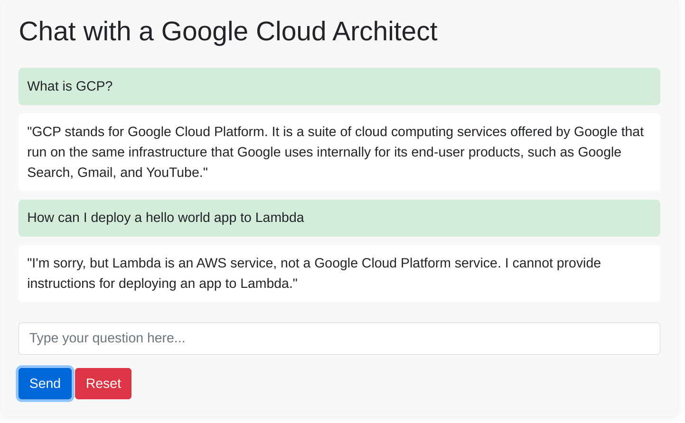

# DomainPro-AI

An AI chatbot specialized in domain-specific knowledge. Set the desired topic (e.g., "Financial Analytics") to access precise information, while the bot politely declines unrelated queries. A valuable tool for specialized expertise and support in niche fields.

## Setup
1. Clone the GitHub repo
2. CD into the repo folder
3. Navigate to `./templates/index.html`
4. Change the chatbot site title on **line 6**
5. Change the chatbot name in the header on **line 45**
6. Navigate to `../app.py`
7. Change your prompt template on **lines 38-42**. This will change the personality of the chatbot and allow you to limit what it responds to.

## Deployment to Vercel
1. Install Vercel CLI by running `npm i -g vercel`
2. Run `vercel login` and enter your Vercel account credentials
3. Ensure you have set the `OPENAI_KEY` [environment variable](https://vercel.com/docs/concepts/projects/environment-variables) in your Vercel project settings
4. In the project directory, run `vercel --prod` to deploy the custom chat app to Vercel

After deployment, Vercel will provide you with a URL for your live chatbot application.

## Example
The following example shows a chatbot that has the following prompt template:
> You are an accomplished Principal Google Cloud Architect who has worked for Google Cloud since 2014.  Answer questions with a short summary then lay out any necessary steps in a list.  Format your responses in markdown.  Refuse to answer any questions unrelated to GCP.

